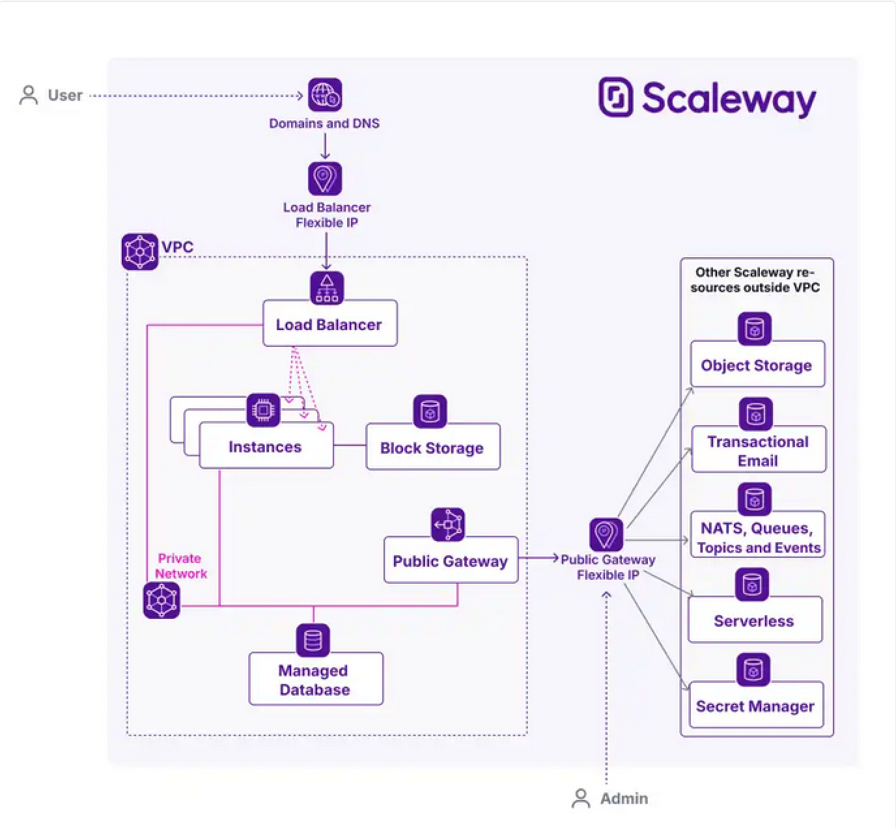

# Demo App

VPC use case 1 - Basic infrastructure to leverage VPC isolation

## Overview

The **Task Tracker App** is a simple web application built with Go. 
It allows users to create, view, toggle the completion status of, and delete tasks. 
The application is containerized using Docker and deployed on a private Scaleway instance, leveraging PostgreSQL for data storage.
All configuration and provisioning is automated using **Terraform** for infrastructure and **cloud-init** for instance configuration at boot time.

## Architecture



## Getting Started

### Installation

#### 1. Clone the Repository

```bash
git clone https://github.com/your-username/task-tracker-app.git
cd demo-app
```

#### 2. Configure Terraform Environment

Set up your Scaleway credentials as environment variables:

```bash
export SCW_ACCESS_KEY="your-access-key"
export SCW_SECRET_KEY="your-secret-key"
export SCW_PROJECT_ID="your-project-id"
```

#### 3. Initialize Terraform

Navigate to the infra directory and initialize Terraform:

```bash
cd infra
terraform init
```

#### 4. Deploy the infrastructure

Run Terraform to provision the infrastructure and deploy the application. Terraform will:

Create a VPC with a private network and a public gateway with a bastion.
Set up a PostgreSQL RDB instance.
Deploy an Ubuntu instance with Docker and the application container via cloud-init.
Configure a Load Balancer to expose the application publicly.

```bash
terraform apply -auto-approve
```

#### 5. Access the Application

Once the deployment is complete, Terraform will output the public IP address of the load balancer. Open the URL in your browser:

```bash
http://<load-balancer-public-ip>
```